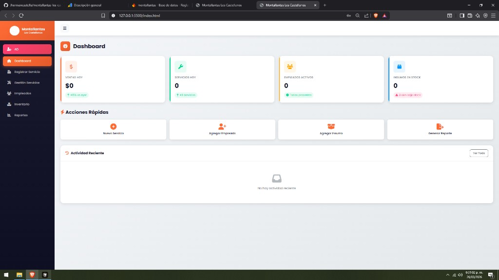
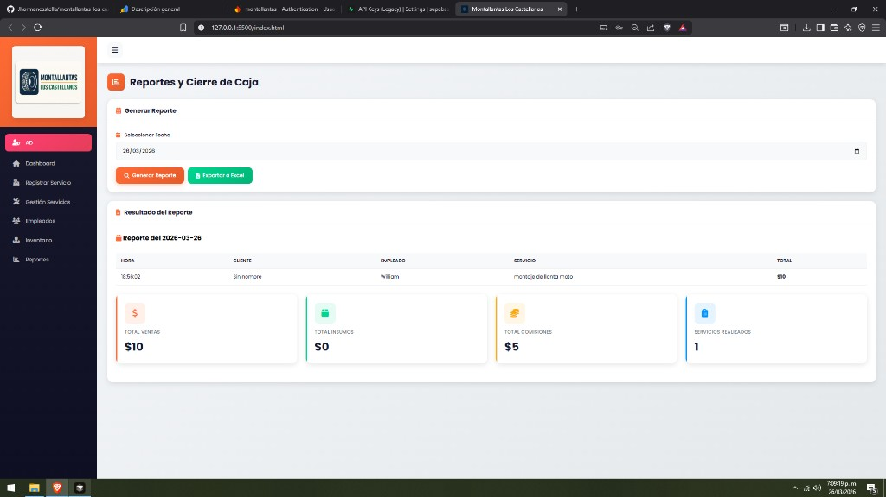
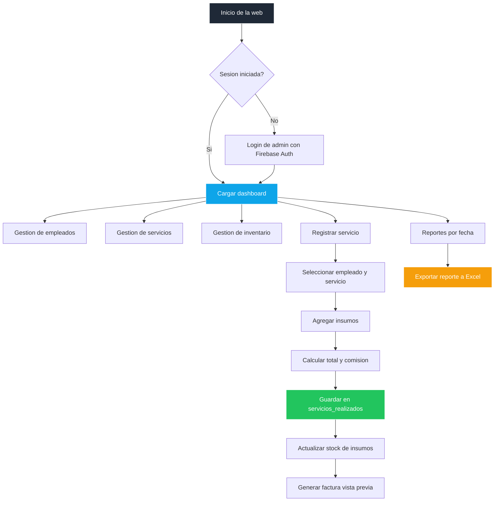

# Montallantas Los Castellanos


---

## Web en vivo

<div align="center">
  <a href="https://jhormancastella.github.io/montallantas-los-castellanos/" target="_blank">
    
  </a>
</div>

---

## Capturas de pantalla

### Dashboard



### Reportes y cierre de caja



---

## Descripcion

**Montallantas Los Castellanos** es un sistema web de gestion para una montallanta, enfocado en operar el negocio del dia a dia desde un panel administrativo:

- Registro de servicios/facturas.
- Gestion de empleados y comisiones.
- Control de inventario (insumos).
- Reportes por fecha y exportacion a Excel.

La app esta desarrollada como frontend web (HTML/CSS/JS), usa **Firebase para autenticacion** y **Supabase (PostgreSQL) para la base de datos**.

---

## Caracteristicas principales

- Panel administrativo con secciones por modulo.
- Registro de servicios con calculo de total, insumos y comision.
- Gestion CRUD de empleados, servicios e insumos.
- Dashboard con indicadores diarios y actividad reciente.
- Reportes por fecha con exportacion a `.xlsx`.
- Sesion de admin con persistencia al recargar.
- Branding personalizado (logo + favicon).
- Estructura lista para SEO tecnico (`robots.txt`, `sitemap.xml`, manifest).

---

## Flujo general del sistema



---

## Tecnologias utilizadas

- **HTML5**: estructura de la aplicacion.
- **CSS3**: estilos responsivos y componentes visuales.
- **JavaScript (ES6+)**: logica de negocio, UI y servicios.
- **Firebase Auth**: autenticacion del administrador.
- **Supabase**: almacenamiento de datos (empleados, servicios, insumos, servicios realizados).
- **SheetJS (XLSX)**: exportacion de reportes a Excel.

---

## Estructura del proyecto

```text
montallantas-los-castellanos/
├── index.html
├── README.md
├── robots.txt
├── sitemap.xml
├── site.webmanifest
├── googlec83d7ace80820036.html
├── assets/
│   └── branding/
│       ├── favicon.png
│       └── logo-header.png
├── css/
│   └── styles.css
└── js/
    ├── app.js
    ├── config.js
    └── services/
        └── app-services.js
```

---

## Configuracion local

1. Clona el repositorio:

   ```bash
   git clone https://github.com/Jhormancastella/montallantas-los-castellanos.git
   cd montallantas-los-castellanos
   ```

2. Ejecuta con servidor local (recomendado: Live Server de VS Code/Cursor).
3. Abre `index.html` en `http://127.0.0.1:5500` (o puerto equivalente).

---

## Configuracion de servicios

### Firebase (autenticacion)

En `js/config.js`:

- `firebase.enabled: true`
- Completar `apiKey`, `authDomain`, `projectId`, etc.

### Supabase (base de datos)

En `js/config.js`:

- `supabase.enabled: true`
- `supabase.url`
- `supabase.anonKey` (clave anon/public, no `service_role`)

Tablas esperadas:

- `empleados`
- `servicios`
- `insumos`
- `servicios_realizados`

---

## SEO y PWA

- `robots.txt` y `sitemap.xml` para indexacion.
- `site.webmanifest` para experiencia tipo app.
- `favicon` y `apple-touch-icon` configurados en `index.html`.

---

## Roadmap sugerido

- Endurecer politicas RLS en Supabase para produccion.
- Integrar Supabase Storage para imagenes de insumos.
- Mejorar control de auditoria (usuario que crea/edita registros).
- Agregar pruebas end-to-end del flujo POS.

---

## Contribuciones

Las contribuciones son bienvenidas:

1. Haz fork del proyecto.
2. Crea una rama:

   ```bash
   git checkout -b feature/mi-mejora
   ```

3. Realiza cambios y commit.
4. Abre un Pull Request.

---

## Licencia

Todos los derechos reservados.

© 2026 Montallantas Los Castellanos.
